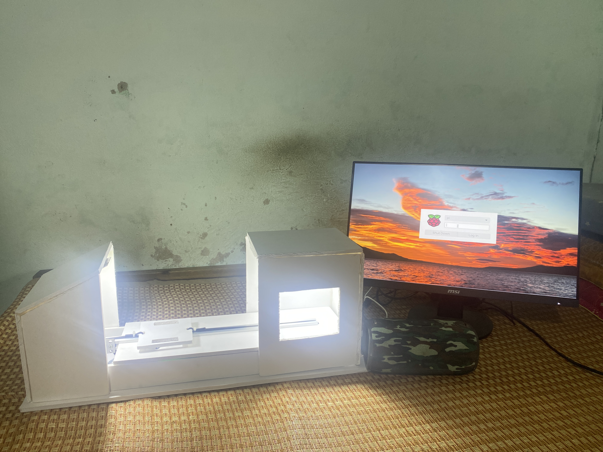
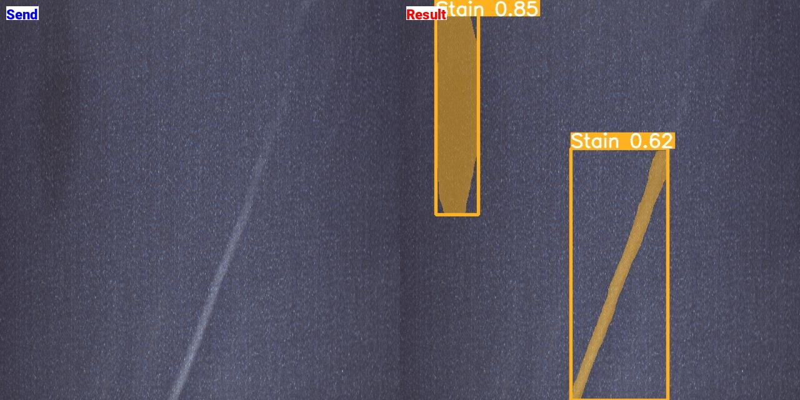

# Fabric Defect Detection System - README File

## Introduction

The Fabric Defect Detection System is an application developed to automatically detect and recognize defects that may appear on the surface of fabric panels. This system utilizes artificial intelligence and deep learning technologies to process images and identify flaws such as holes, stains, knot, line.

## Features

- FastAPI: The system is built using FastAPI, a modern, fast (high-performance), web framework for building APIs with Python.
- YOLOv5s Segmentation: The system utilizes YOLOv5s, a state-of-the-art object detection and segmentation algorithm, to detect and segment fabric defects.
- Python and C++: The system leverages the power of both Python and C++ programming languages for different components of the application.
- Efficient and Accurate: The combination of FastAPI, YOLOv5s, and the use of Python and C++ ensures a highly efficient and accurate defect detection system for fabric panels.
  

## Hardware Requirements

To set up and run the Fabric Defect Detection System, you will need the following hardware components:

1. Raspberry Pi:

   - Raspberry Pi board (preferably Raspberry Pi 3 or higher)
   - Power supply for Raspberry Pi
   - MicroSD card (minimum 8GB) with Raspbian OS installed

2. Arduino:

   - Arduino board (Arduino Uno or compatible)
   - USB cable for connecting Arduino to Raspberry Pi

3. Camera:

   - Raspberry Pi compatible camera module
   - Appropriate camera cable (if required)

4. Light Sensor:

   - Light sensor module (e.g., LDR, photodiode, or similar)
   - Resistor(s) for voltage division (if required)
   - Mounting brackets or fixtures for positioning the light sensor

5. Miscellaneous:
   - Breadboard and jumper wires (for connecting Arduino components)
   - LED indicators (optional, for visual feedback)
   - Pushbuttons or sensors (optional, for manual control or triggering)

## Dataset

https://universe.roboflow.com/capstone-project-baym7/bkdn-huylv-datn/browse?queryText=&pageSize=50&startingIndex=0&browseQuery=true

## Contributing

Contributions to this project are highly appreciated. If you encounter any issues, please open an issue on the project's GitHub page or submit a pull request for improvements and bug fixes.

## Contact

If you have any questions or inquiries, please contact huyledut@gmail.com.
